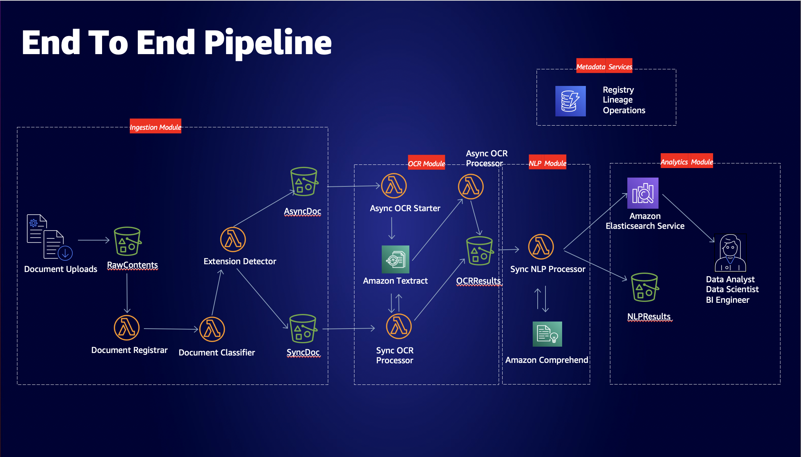
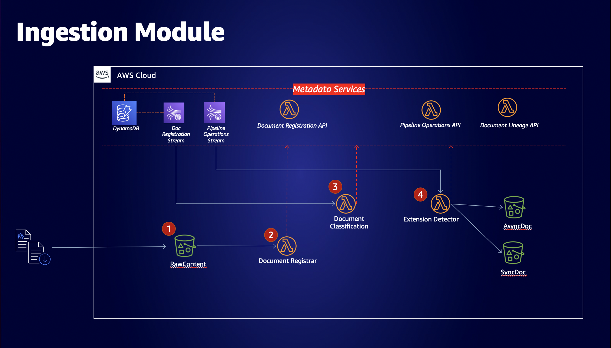
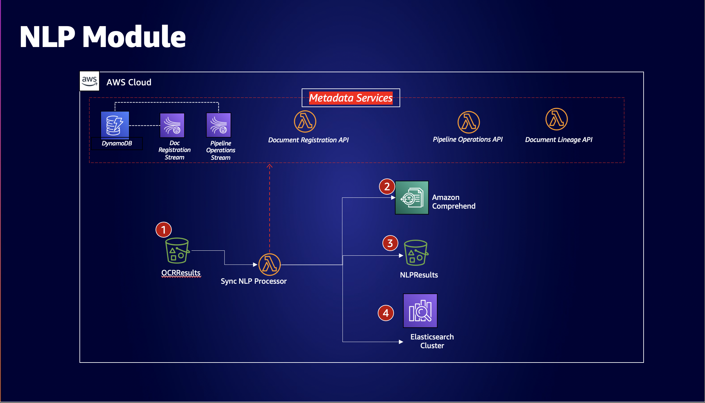
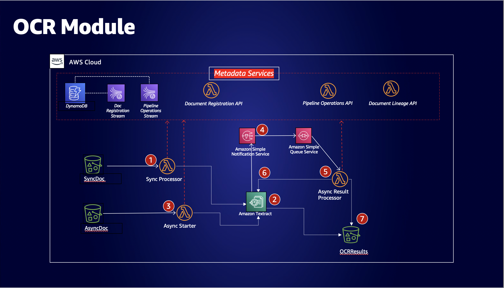
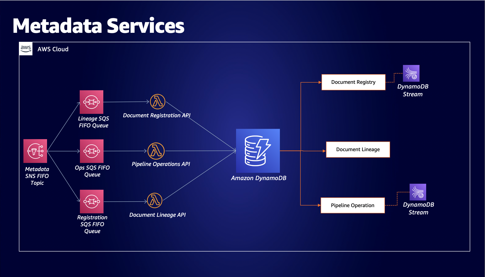

# AWS Natural Language Processing Solution

## About

This solution implements a document processing pipeline using [Amazon Textract](https://aws.amazon.com/textract), [Amazon Comprehend](https://aws.amazon.com/comprehend), [Amazon Elasticsearch Service](https://aws.amazon.com/elasticsearch-service), and [Amazon S3](https://aws.amazon.com/s3), with a surrounding governance framework and lineage services with the help of [Amazon DynamoDB](https://aws.amazon.com/dynamodb), [Amazon SNS](https://aws.amazon.com/sns), [Amazon SQS](https://aws.amazon.com/sqs), and [AWS Lambda](https://aws.amazon.com/lambda/).

## Use Case

Customers in regulated industries want to use machine learning services to automate, annotate, and enhance their static document processing capabilities. However, there are strong compliance and data governance concerns in the field.

This solution is an end to end example of how customers can architect their solutions using asynchronous metadata services, that tie together steps of document processing pipelines, and their outputs, to the original document, thus creating a governance model centered around data lineage and registries of uploaded documents.

## Architecture

### Whole Pipeline: Figure 1

### Ingestion Module: Figure 2

### NLP Module: Figure 3

### OCR Module: Figure 4

### Metadata Services Module: Figure 5


## Requirements

* A Linux or MacOS-compatible machine
* An AWS account with sufficient permissions

## Installation

To create the infrastructure, use [aws-cdk](https://github.com/aws/aws-cdk), a software development framework to model and create AWS infrastructure. Use the [npm](https://docs.npmjs.com/downloading-and-installing-node-js-and-npm) package manager to install aws-cdk. Then, download the [AWS CLI](https://aws.amazon.com/cli/).
```
npm install -i aws-cdk@latest
```
Double check you are logged into the AWS account you wish to be deploying the solution to
```
aws configure
aws sts get-caller-identity
```
## Deployment

Navigate to the [code/](code/) folder and execute the build script to
  * setup the python dependencies in Lambda layers
  * copy the code and set up the folder structure for cdk
```
cd code/
bash build.sh
```

Next, navigate to the [infrastructure/](infrastructure/) folder and download the corresponding npm modules used for each AWS resource.
```
cd ../infrastructure 
npm install -i

# To ensure all packages are up to date
npm outdated

# If any packages are outdated, update them using the following command.
# Warning: Could cause breaking changes
npm install -i aws-xxxxx@latest
```

Once packages are up-to-date, bootstrap the cdk application, and deploy
```
# Bootstrap CDK Application
cdk bootstrap
# Deploy CDK Application
cdk deploy -all
# When prompted for deploying changes, enter 'y' to agree to the resource creation
```
This action should trigger creation of three CloudFormation stacks in the appropriate account, and deploy the resources for the `Metadata`, `Analytics`, and `TextractPipeline` modules.

### Additional Comments
To see a CloudFormation template generated from CDK, use the following command
```
cdk synth -all
```
## Deletion
To trigger stack deletion, execute the destroy command for the application.
```
cdk destroy -all
# When prompted for deploying changes, enter 'y' to agree to the resource creation
```

## Security

See [CONTRIBUTING](CONTRIBUTING.md#security-issue-notifications) for more information.

## License

This project is licensed under the Apache-2.0 License.

